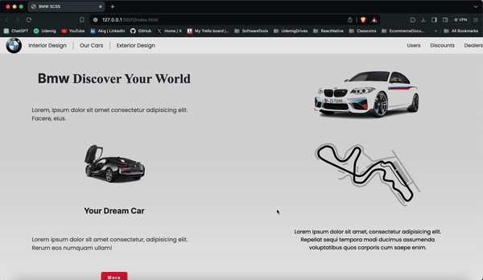

# BMW

Bu repo, BMW arabalarının sergilendiği tamamen duyarlı bir web sitesinin kaynak kodlarını içerir. Web sitesi, HTML ve SCSS kullanılarak oluşturulmuş olup, bakımı ve tekrar kullanımı kolaylaştırmak amacıyla modüler bir SCSS mimarisi ve değişkenler kullanılarak tasarlanmıştır. Tasarım, bir banner içeren bir başlık, arabaların listelendiği ana bir bölüm ve bir altbilgi kısmını içerir.

<h2>Özellikler</h2>

<ul>
<li>Duyarlı Tasarım: Web sitesi tamamen duyarlıdır ve farklı ekran boyutlarına ve cihazlara mükemmel bir şekilde uyum sağlar.</li>
<li>Modüler SCSS: SCSS dosyaları, kolay bakım ve ölçeklenebilirlik için modüler bir yapıda düzenlenmiştir. SCSS değişkenleri, renkler ve font boyutları gibi stil öğelerinin tutarlılığını sağlamak için kullanılmıştır.</li>
<li>Kullanıcı Dostu Arabirim: Kullanıcıların arabaları kolayca gözden geçirebilmeleri için sezgisel bir arayüz tasarlanmıştır.
</ul>

<h2>GIF</h2>

